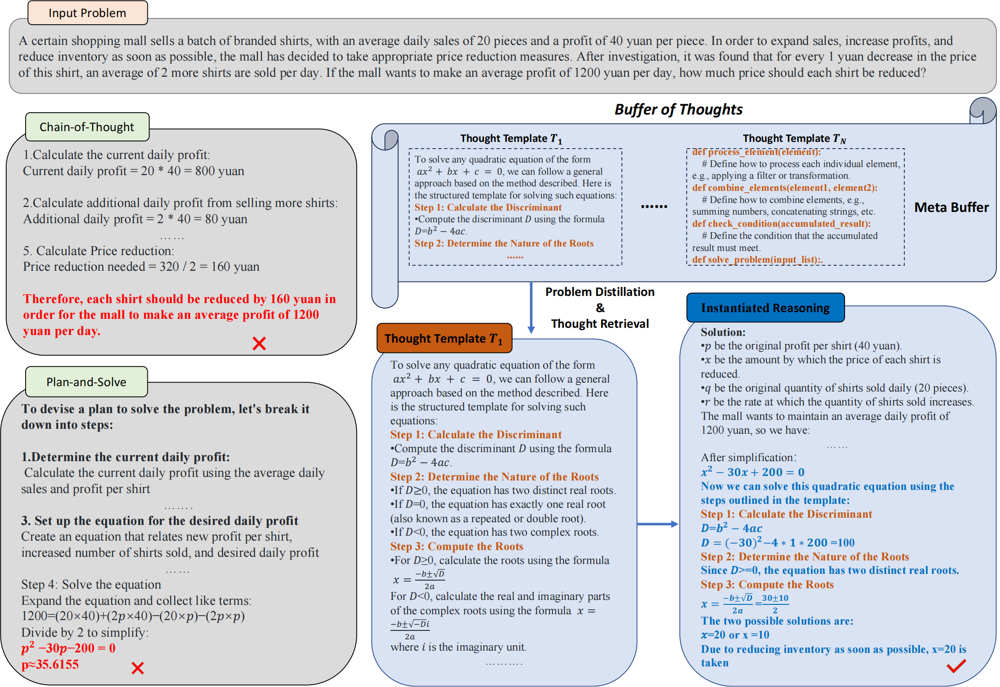

# Buffer of Thoughts: Thought-Augmented Reasoning with Large Language Models 

 <a href='https://arxiv.org/abs/2406.04271'></a> &nbsp;&nbsp;&nbsp;&nbsp;&nbsp;

Official implementation of our [Buffer of Thoughts (BoT)](https://arxiv.org/abs/2406.04271) framework (**NeurIPS 2024 Spotlight**). Affiliation: Peking University, UC Berkeley, Stanford University


## Introduction

We introduce **BoT**, a novel and versatile thought-augmented reasoning approach designed to enhance the accuracy, efficiency, and robustness of large language models (LLMs). Specifically, we propose a **meta-buffer** to store a series of high-level thoughts, referred to as **thought-templates**, distilled from problem-solving processes across various tasks. For each problem, we retrieve a relevant thought-template and adaptively instantiate it with specific reasoning structures to conduct efficient reasoning. To ensure scalability and stability, we also propose a **buffer-manager** to dynamically update the meta-buffer, thus enhancing its capacity as more tasks are solved. We conduct extensive experiments on 10 challenging reasoning-intensive tasks, achieving significant performance improvements over previous state-of-the-art (SOTA) methods: 11% on Game of 24, 20% on Geometric Shapes, and 51% on Checkmate-in-One. Further analysis demonstrates the superior generalization ability and robustness of our BoT, while requiring only 12% of the cost of multi-query prompting methods (e.g., tree/graph of thoughts) on average. Notably, we find that our **Llama3-8B + BoT has the potential to surpass Llama3-70B** model.

<table class="center">
    <tr>
        <td width=100% style="border: none"></td>
    </tr>
    <tr>
        <td width="100%" style="border: none; text-align: center; word-wrap: break-word">Overview of our BoT</td>
    </tr>
</table>


## Comparison between Different Methods

| Task/Method           | GPT-4 | PAL  | ToT  | Meta Prompting | BoT (Ours) |
| --------------------- | :-----: | ---- | ---- | :--------------: | :----------: |
| Game of 24            | 3.0   | 64.0 | 74.0 | 67.0           | **82.4**   |
| MGSM (avg)            | 84.4  | 72.0 | 86.4 | 84.8           | **89.2**   |
| Multi-Step Arithmetic | 84.0  | 87.4 | 88.2 | 90.0           | **99.8**   |
| WordSorting           | 80.4  | 93.2 | 96.4 | 99.6           | **100.0**  |
| Python Puzzles        | 31.1  | 47.3 | 43.5 | 45.8           | **52.4**   |
| Geometric Shapes      | 52.6  | 51.2 | 56.8 | 78.2           | **93.6**   |
| Checkmate-in-One      | 36.4  | 10.8 | 49.2 | 57.0           | **86.4**   |
| Date Understanding    | 68.4  | 76.2 | 78.6 | 79.2           | **88.2**   |
| Penguins              | 71.1  | 93.3 | 84.2 | 88.6           | **94.7**   |
| Sonnet Writing        | 62.0  | 36.2 | 68.4 | 79.6           | **80.0**   |


## Evaluation with Buffer of Thoughts

### 1. Benchmarks 

For now, we release our demo version of BoT based on three different benchmarks:

- **The Game of 24** from [Yao et al., 2023](https://github.com/princeton-nlp/tree-of-thought-llm)
- **Checkmate-in-One** from [the BIG-Bench suite](https://github.com/google/BIG-bench/tree/main) [(BIG-Bench authors, 2023)](https://arxiv.org/abs/2206.04615)
- **Word Sorting** from [BIG-Bench Hard](https://github.com/suzgunmirac/BIG-Bench-Hard) ([Suzgun et al., 2023](https://arxiv.org/abs/2210.09261); [BIG-Bench authors, 2023](https://github.com/google/BIG-bench/tree/main))

### 2. Meta Buffer

For each task, we choose one thought template sampled from our meta-buffer library. You may use our framework to construct your own meta buffer.

### 3. Quick Start

First, set up the environment:

```bash
git clone https://github.com/YangLing0818/buffer-of-thought-llm
cd buffer-of-thought-llm
conda create -n BoT python==3.9 
pip install -r requirements.txt
```

#### 3.1. Running on Three Benchmarks

Our BoT is easy to use. Just run:

```bash
python run_benchmarks.py --task_name 'gameof24' --api_key 'input your API key here if you want to use GPT-4' --model_id 'the model ID of GPT-4 or the path to your local LLM'
```

Here, **--task_name** could be one of gameof24, checkmate, wordsorting.

The **--api_key** is required if you want to use GPT-series; if not, you can skip it.

The **--model_id** should be the model ID of GPT-series like gpt-4o, gpt-4-turbo, or the path to your local LLM if you do not set **--api_key**.

The data for these three tasks are located in the `/benchmarks` directory.

The results generated during the experiment are stored in the `/test_results` directory.

#### 3.2. Validate the Test Results

Run the command below to validate the test results of our BoT:

```python
python validate_results.py --task_name 'gameof24' --test_path 'The path to the .jsonl file you want to validate'
```

This will print out the accuracy of the selected task on your relevant .jsonl file.

## 📖 BibTeX

```
@article{yang2024buffer,
  title={Buffer of Thoughts: Thought-Augmented Reasoning with Large Language Models},
  author={Yang, Ling and Yu, Zhaochen and Zhang, Tianjun and Cao, Shiyi and Xu, Minkai and Zhang, Wentao and Gonzalez, Joseph E and Cui, Bin},
  journal={arXiv preprint arXiv:2406.04271},
  year={2024}
}
```
